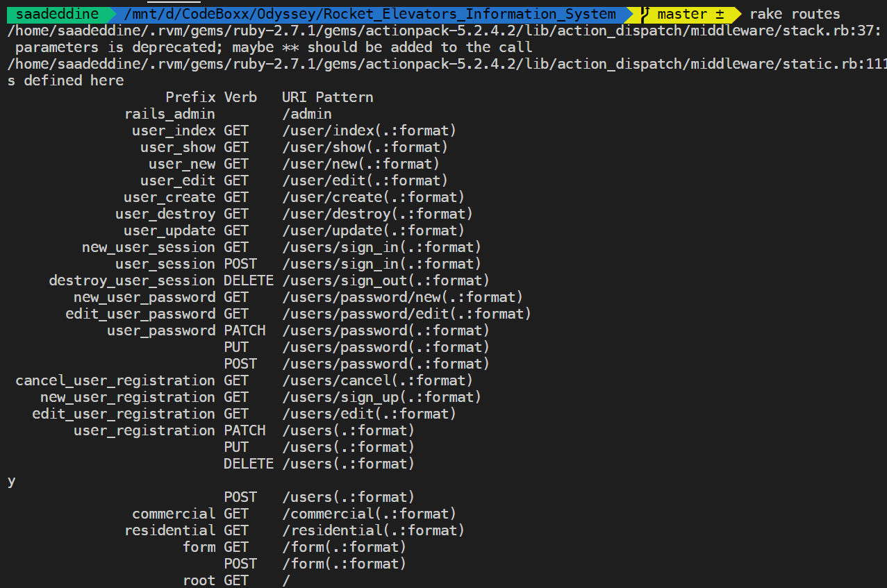

&#xa0;

  <!-- Saad Eddine FEKI -->
</div>

<h1 align="center"> 🚀 Rocket Elevators ---- By Cindy, Christ, Joey et Saad</h1>

<!-- Status -->

<h4 align="center">
  🚀  CodeBoxx
</h4>

<hr>

<p align="center">
  <a href="#dart-about">About</a> &#xa0; | &#xa0; 
  <a href="#sparkles-features">Features</a> &#xa0; | &#xa0;
  <a href="#white_check_mark-requirements">Instructions to acces to th admin panel</a> &#xa0; | &#xa0;
  <a href="#checkered_flag-starting">Starting</a> &#xa0; | &#xa0;
  <a href="#memo-license">License</a> &#xa0; | &#xa0;
  <a href="https://github.com/cindyokino" target="_blank">Cindy Okino &#xa0; | &#xa0;</a>
  <a href="https://github.com/Jcoderre" target="_blank">Joey Coderre &#xa0; | &#xa0;</a>
  <a href="https://github.com/Christ-Saravia" target="_blank">Christ-Saravia &#xa0; | &#xa0;</a>
  <a href="https://github.com/saadeddine" target="_blank">Saad eddine &#xa0; | &#xa0;</a>
</p>

<br>

## :dart: About

1. Making a static website dynamic by implementing the MVC model.
   This architecture was chosen by the corporate architect at Rocket Elevators to set up the company's new information system.
2. Expanding the relational database model
3. Implementation of a Data Warehouse
4. Seeding data base with data NB: real adress are used

🎞️ Video demonstration : <a href="https://youtu.be/z47oGSMz6aQ" target="_blank">Rockect Elevator MVC architecture &#xa0; | &#xa0;</a>

## :sparkles: Features

<ol>
<li>HTML 5</li>
<li>CSS 3</li>
<li>Javascript</li>
<li>Bootstrap</li>
<li>MySqL</li>
<li>Postgres</li>
<li>Ruby on rails</li>
<li>Ubuntu</li>
</ol>

📚 The three queries:

```sh
SELECT to_char(creation,'yyyy Month') AS selected_month, COUNT(contactid) as monthly_contacts
    FROM factcontact
GROUP BY selected_month
```

```sh
SELECT to_char(creation,'yyyy Month') AS selected_month, COUNT(quoteid) as monthly_quotes
    FROM factquotes
GROUP BY selected_month
```

```sh
SELECT SUM(nbelevators) as elevators_per_customer, companyname
    FROM dimcustomers
GROUP BY companyname
```

📚 Instructions to acces to th admin panel:

To log as Admin:

```sh
1. Navigation bar : Member
2. Login
3. Username: mathieu.houde@codeboxx.biz
   password: 123456
4. Member : Admin Panel
```

📚 Instructions to acces to use Blazer (Chart): unfortunately doesn't work because of connexion with amazon database

```sh
1. Admin Panel
2. Links
3. Chart

```

## :memo: Routes

- homepage: <b>/</b>
- residential page: <b>/residential</b>
- commercial page: <b>/commercial</b>
- form page: <b>/form</b>
- thank you page: <b>/thank-you</b>
- Admin panel: <b>/admin</b>

```sh
rake routes
```



<hr>

## :memo: License

- This project is under license from CodeBoxx.

Made with :heart: by

- Cindy Okino
- Joey Coderre
- Christ Saravia
- Saad Eddine

&#xa0;

<a href="#top">Back to top</a>
